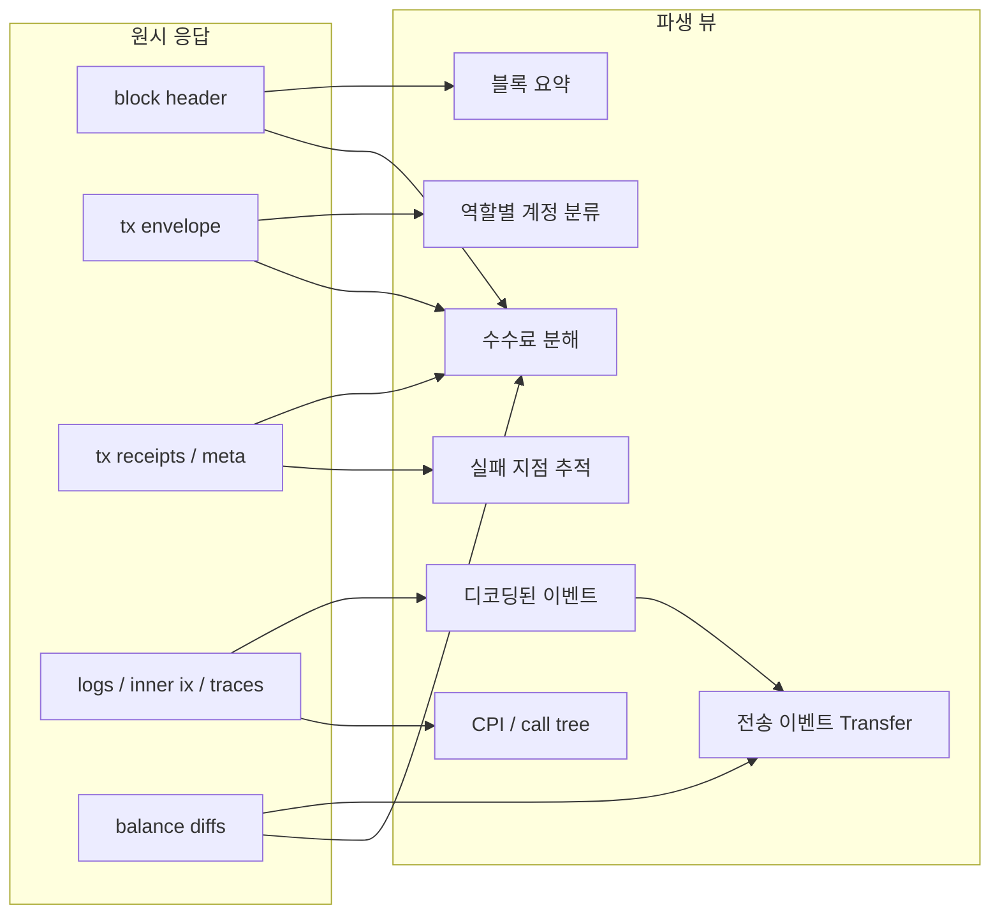
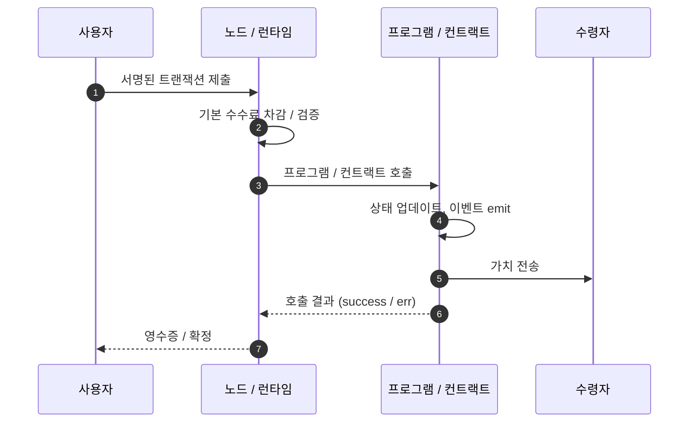
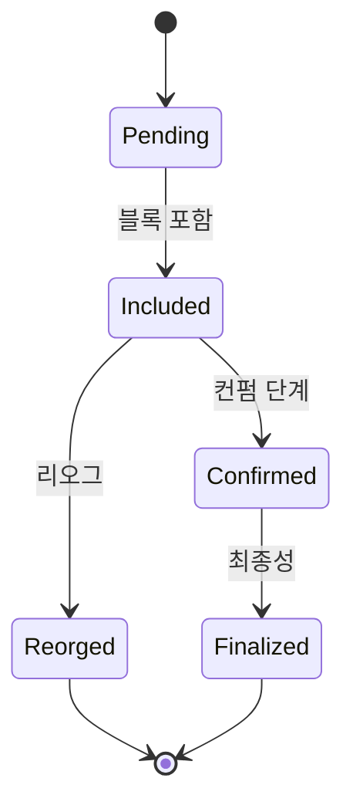

# {{TITLE}}

<p><em>{{META_SUBTITLE}} &nbsp;|&nbsp; 작성일: {{YYYY-MM-DD}} &nbsp;|&nbsp; 대상: {{SAMPLE_OR_SCOPE}}</em></p>

---

## 목차

1. [개요와 범위](#sec-overview)
2. [Raw → 파생 뷰 다이어그램](#sec-diagrams)
3. [프로토콜 수준 분석](#sec-protocol)
4. [코드 수준 분석](#sec-code)
5. [온체인 데이터 뷰](#sec-onchain)
6. [인덱서 파생 뷰](#sec-derivations)
7. [예제 패턴](#sec-examples)
8. [조합 패턴 - 교차 분석](#sec-combine)
9. [파싱 / 인덱싱 체크리스트](#sec-checklist)
10. [References](#sec-references)

---

<a id="sec-overview"></a>
## 1. 개요와 범위

> 이 섹션은 리포트의 목적, 독자, 다루는 범위와 다루지 않는 범위를 한눈에 정리한다. 문제의 배경, 이 리포트가 해결하려는 질문, 그리고 사용된 자료와 그렇지 않은 자료의 경계를 명시한다.

{{OVERVIEW_PARAGRAPH}}

### 1.1 조사 질문

- {{QUESTION_1}}
- {{QUESTION_2}}

### 1.2 범위와 제약

- **다룬다:** {{IN_SCOPE}}
- **다루지 않는다:** {{OUT_OF_SCOPE}}

---

<a id="sec-diagrams"></a>
## 2. Raw → 파생 뷰 다이어그램

> 이 섹션은 원시 체인 응답 필드들이 인덱서 / 분석 파이프라인의 파생 뷰로 흐르는 경로를 시각화한다. 모든 리포트는 다음 네 종류의 다이어그램을 포함해야 한다: (1) 파이프라인 흐름도 Mermaid flowchart, (2) 시간 순 액터 상호작용 Mermaid sequence diagram, (3) 상태 전이 Mermaid state diagram, (4) Mermaid 로 표현하기 어려운 구조(바이트 오프셋 맵, 역할 사분면 등)를 위한 인라인 SVG.

### 2.1 데이터 파이프라인 (Mermaid flowchart)

원시 응답 필드와 파생 뷰의 관계. 한 원시 필드가 여러 파생을 먹이고, 한 파생이 여러 원시에 의존한다.



*그림 1. 원시 필드 → 파생 뷰 매핑 (예시). 실제 리포트에서는 체인별 필드명으로 교체한다.*

### 2.2 시간 순 상호작용 (Mermaid sequence diagram)

송신자부터 수신자까지 한 트랜잭션이 어떤 액터를 거치는지의 생애 주기.



*그림 2. 한 트랜잭션의 시간 순 시퀀스. 구체적 액터는 체인별로 교체한다.*

### 2.3 상태 전이 (Mermaid state diagram)

트랜잭션 / 인스트럭션 / 커밋 상태의 전이. 체인에 따라 가지치기 구조가 달라진다.



*그림 3. 트랜잭션 상태 전이 (체인별로 단계 이름을 바꾸어 사용).*

### 2.4 구조 맵 (인라인 SVG)

Mermaid 로 표현하기 어려운 구조 -- 바이트 오프셋 맵, 계정 역할 사분면, effective_keys 레이아웃 등 -- 에는 SVG 를 직접 그린다. 아래는 템플릿 예시이며, 실제 리포트에서는 체인별 구조로 교체한다.

<svg viewBox="0 0 820 280" xmlns="http://www.w3.org/2000/svg" font-family="'Noto Sans KR', -apple-system, sans-serif" font-size="11" role="img">
  <title>원시 응답 구조를 도메인별 박스로 나눈 예시</title>
  <defs>
    <marker id="arrTm" viewBox="0 0 10 10" refX="9" refY="5" markerWidth="6" markerHeight="6" orient="auto-start-auto">
      <path d="M 0 0 L 10 5 L 0 10 z" fill="#333"/>
    </marker>
  </defs>
  <rect x="20" y="20" width="350" height="240" fill="#fafafa" stroke="#999"/>
  <text x="195" y="42" text-anchor="middle" font-weight="700" font-size="12">원시 필드 그룹</text>
  <rect x="30" y="60" width="330" height="30" fill="#fff" stroke="#333"/>
  <text x="40" y="80">블록 수준 (height / time / parent)</text>
  <rect x="30" y="98" width="330" height="30" fill="#fff" stroke="#333"/>
  <text x="40" y="118">트랜잭션 수준 (envelope / signatures / fee)</text>
  <rect x="30" y="136" width="330" height="30" fill="#fff" stroke="#333"/>
  <text x="40" y="156">실행 수준 (logs / inner ix / traces)</text>
  <rect x="30" y="174" width="330" height="30" fill="#fff" stroke="#333"/>
  <text x="40" y="194">상태 변화 (balance diff / account diff)</text>
  <rect x="30" y="212" width="330" height="30" fill="#fff" stroke="#333"/>
  <text x="40" y="232">프로토콜 수준 (rewards / burn / withdrawals)</text>

  <rect x="470" y="20" width="330" height="240" fill="#f4f4f4" stroke="#666"/>
  <text x="635" y="42" text-anchor="middle" font-weight="700" font-size="12">인덱서 파생 도메인</text>
  <rect x="480" y="60" width="310" height="30" fill="#fff" stroke="#111"/>
  <text x="490" y="80" font-weight="600">블록 요약 / 리워드 분해</text>
  <rect x="480" y="98" width="310" height="30" fill="#fff" stroke="#111"/>
  <text x="490" y="118" font-weight="600">트랜잭션 본문 / 수수료 분해</text>
  <rect x="480" y="136" width="310" height="30" fill="#fff" stroke="#111"/>
  <text x="490" y="156" font-weight="600">디코딩된 이벤트 / 호출 트리</text>
  <rect x="480" y="174" width="310" height="30" fill="#fff" stroke="#111"/>
  <text x="490" y="194" font-weight="600">Transfer / Mint / Burn</text>
  <rect x="480" y="212" width="310" height="30" fill="#fff" stroke="#111"/>
  <text x="490" y="232" font-weight="600">잔액 불변량 / 실패 위치</text>

  <line x1="370" y1="75" x2="470" y2="75" stroke="#333" marker-end="url(#arrTm)"/>
  <line x1="370" y1="113" x2="470" y2="113" stroke="#333" marker-end="url(#arrTm)"/>
  <line x1="370" y1="151" x2="470" y2="151" stroke="#333" marker-end="url(#arrTm)"/>
  <line x1="370" y1="189" x2="470" y2="189" stroke="#333" marker-end="url(#arrTm)"/>
  <line x1="370" y1="227" x2="470" y2="227" stroke="#333" marker-end="url(#arrTm)"/>
</svg>

*그림 4. 원시 필드 5개 그룹 → 파생 도메인 5개 매핑. 구조 맵은 단색 팔레트와 타이트한 박스 정렬을 유지한다.*

<details>
<summary>ASCII 대체 (인라인 SVG 를 렌더링하지 못하는 뷰어용)</summary>

```
+--------------------------------+       +--------------------------------+
|  원시 필드 그룹                 |       |  인덱서 파생 도메인              |
+--------------------------------+       +--------------------------------+
| 블록 수준                       | ---- > | 블록 요약 / 리워드 분해           |
| 트랜잭션 수준                    | ---- > | 트랜잭션 본문 / 수수료 분해       |
| 실행 수준 (logs / inner / trace)| ---- > | 디코딩된 이벤트 / 호출 트리         |
| 상태 변화 (balance / account)   | ---- > | Transfer / Mint / Burn         |
| 프로토콜 수준 (rewards / burn)   | ---- > | 잔액 불변량 / 실패 위치            |
+--------------------------------+       +--------------------------------+
```

</details>

---

<a id="sec-protocol"></a>
## 3. 프로토콜 수준 분석

> 스펙 / 개선 제안 / 합의 규칙 수준에서 주제를 설명한다. 왜 이런 설계인지, 어떤 대안과 비교되는지, 어떤 합의 규칙이 걸려 있는지.

{{PROTOCOL_PARAGRAPH}}

### 3.1 관련 개선 제안

| 번호 | 제목 | 상태 | 링크 |
|------|------|------|------|
| {{ID}} | {{TITLE}} | {{STATUS}} | [{{URL}}]({{URL}}) |

---

<a id="sec-code"></a>
## 4. 코드 수준 분석

> 클라이언트 구현에서 해당 규칙이 어떻게 인코딩되어 있는지 파일 / 라인 수준으로 짚는다. 형식: `<RESEARCH_ROOT>/{repo}/{path}:{line}`. 필요하면 짧은 코드 발췌를 붙인다.

- `<RESEARCH_ROOT>/{repo}/{path}:{line}` -- {{WHAT}}

```
{{CODE_EXCERPT}}
```

---

<a id="sec-onchain"></a>
## 5. 온체인 데이터 뷰

> 실제 응답에서 보이는 필드 / 레코드 / balance diff / 로그 / 수수료 분해를 필드별로 분해한다. 표와 예시 응답을 병기한다.

### 5.1 최상위 필드

| 필드 | 의미 | 예시값 |
|------|------|--------|
| `{{FIELD}}` | {{MEANING}} | {{SAMPLE}} |

### 5.2 예시 응답

```
{{RAW_SAMPLE_JSON}}
```

> **불변량:** {{INVARIANT_STATEMENT}}. 파싱 오류는 이 불변량을 위반하는 즉시 감지된다.

---

<a id="sec-derivations"></a>
## 6. 인덱서 파생 뷰

> 인덱서가 원시 필드로부터 어떤 파생 레코드를 만드는지, 어떤 입력을 조합하는지.

| 파생 뷰 | 입력 조합 | 용도 |
|---------|-----------|------|
| {{VIEW}} | {{INPUTS}} | {{USE}} |

---

<a id="sec-examples"></a>
## 7. 예제 패턴

> 주제와 관련된 전형적인 패턴을 구체적인 응답 조각과 함께 보인다. 실제 tx 가 없는 경우 합성 예제로 대체한다.

```
{{EXAMPLE_SNIPPET}}
```

---

<a id="sec-combine"></a>
## 8. 조합 패턴 - 교차 분석

> 섹션 5/6/7 에서 본 개별 필드들을 어떻게 조합해 더 높은 수준의 사실을 복원하는지. 교차 검증식, 역추론 워크플로우 등.

1. {{STEP_1}}
2. {{STEP_2}}
3. {{STEP_3}}

---

<a id="sec-checklist"></a>
## 9. 파싱 / 인덱싱 체크리스트

> 이 주제를 다룰 때 파서 / 인덱서가 반드시 통과해야 할 항목들. 자체 감사용으로 GitHub task-list 체크박스를 사용한다.

- [ ] {{CHECK_1}}
- [ ] {{CHECK_2}}
- [ ] {{CHECK_3}}
- [ ] {{CHECK_4}}
- [ ] {{CHECK_5}}

---

<a id="sec-references"></a>
## 10. References

### 로컬 소스

1. `<RESEARCH_ROOT>/{repo}/{path}:{line}` -- {{DESC}}

### 공식 문서

1. [{{TITLE}}]({{URL}})

### 커뮤니티 / 블로그 / 포럼

1. [{{TITLE}}]({{URL}})

---

*본 리포트는 `blockchain-research:{{CHAIN}}-researcher` 스킬로 생성되었습니다. -- {{YYYY-MM-DD}}*
